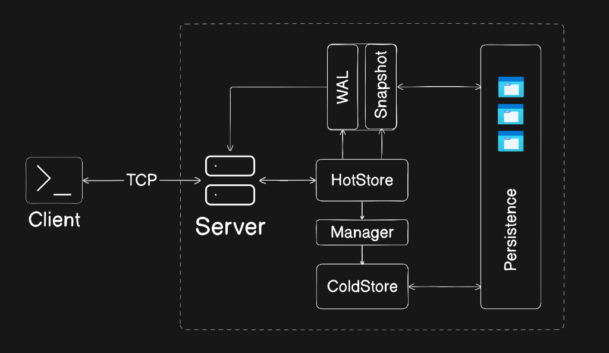

# ThermalKV

<p align="center">
  <a href="https://github.com/Jenil1105/ThermalKV/releases/tag/v0.1.0">
    
  </a>
  <a href="https://thermalkv.onrender.com/">
    
  </a>
  <a href="https://golang.org/">
    
  </a>
</p>

ThermalKV is a Go key-value store implementing hot in-memory storage with durable persistence and manual cold storage migration. It demonstrates TTL expiration, WAL durability, snapshot recovery, cold storage indexing, and a simple TCP client/server interface.

---

## 🔗 Quick Links

* **Live Documentation:** [ThermalKV DOCs](https://thermalkv.onrender.com/)
* **Latest Release:** [v0.1.0 Release](https://github.com/Jenil1105/ThermalKV/releases/tag/v0.1.0)

---

## Features

* Thread-safe in-memory key-value store.
* Per-key TTL expiration.
* Background expiration cleaner.
* Write-Ahead Logging (WAL) durability.
* Snapshot persistence for faster restarts.
* Manual cold storage migration (`COOL` command).
* Lazy cold-key restoration on access.
* TCP server/client architecture.
* Graceful shutdown with final snapshot save.

---

## Architecture

Below is the design and architecture diagram of ThermalKV:




---

## Storage Model

### Hot Storage

* Active keys are stored in memory.
* Supports fast GET/SET/DEL operations.
* Tracks TTL and last-access times.

### Cold Storage

* Keys can be manually cooled with `COOL <key>`.
* Cold entries are persisted to `data/cold.dat`.
* Cold-key lookup restores valid values back into hot memory.

---

## Code Components

### Server

`cmd/server/main.go`

* Creates WAL and coldstore manager.
* Initializes the store.
* Recovers state from snapshot, WAL, and cold index.
* Starts TTL cleaner, snapshot loop, and cooling worker.
* Listens on TCP port `8080`.

### Client

`cmd/client/main.go`

* Interactive TCP client for sending commands.
* Connects to `localhost:8080`.
* Reads and prints server responses.

### Store

`internal/store`

Handles core database operations:

* SET, GET, DEL
* TTL registration and expiry
* Cold key migration and lazy restore
* Snapshot export
* Recovery from WAL and snapshot data

### Persistence

`internal/persistence`

Handles disk persistence:

* WAL write and replay
* Snapshot save and load

### Cold Storage

`internal/coldstore`

Handles:

* Cold data append storage.
* Cold index management.
* Loading cooled keys on demand.

### Recovery

`internal/recover`

Handles:

* Snapshot recovery.
* WAL replay for `SET`, `DEL`, and `EXPIRE`.
* Cold index recovery.

### TTL Scheduler

`internal/ttl`

Implements:

* Min-heap expiry queue.
* Background expiration cleanup.

---

## Runtime Files

| File                | Purpose                          |
| ------------------- | -------------------------------- |
| `data/wal.log`      | Write-Ahead Log                  |
| `data/snapshot.dat` | Snapshot persistence             |
| `data/cold.dat`     | Cold storage append-only file    |

---

## Supported Commands

| Command               | Description                            |
| --------------------- | -------------------------------------- |
| `SET <key> <value>`   | Store or update a value                |
| `GET <key>`           | Retrieve a value                       |
| `DEL <key>`           | Delete a key                           |
| `TTL <key> <seconds>` | Set expiration if the key exists       |
| `COOL <key>`          | Move a key into cold storage           |
| `COUNT`               | Number of hot keys in memory           |
| `EXISTS <key>`        | Check whether a key exists             |
| `KEYS`                | List all hot keys                      |
| `INFO`                | Store statistics                       |
| `EXIT`                | Close client connection                |

---

## Example Session

```text
SET user1 jenil
OK :)

GET user1
jenil

TTL user1 30
OK :)

EXISTS user1
true

COOL user1
OK :)

GET user1
jenil
```

The final `GET` restores the cooled key back into memory.

---

## Persistence and Recovery

The server persists mutations to WAL and periodically saves snapshots.

### WAL

Write-Ahead Log entries are appended to `data/wal.log`.

Recorded operations:

* `SET`
* `DEL`
* `EXPIRE`

WAL logs are replayed during recovery.

### Snapshots

Snapshots save the in-memory state to `data/snapshot.dat`, reducing recovery time.

---

## Recovery Process

On startup the server:

1. Loads the latest snapshot.
2. Replays WAL entries from `data/wal.log`.
3. Recovers the cold storage index.
4. Starts the TTL cleaner.

---

## Technical Highlights

* Go-based concurrent key-value store.
* RWMutex synchronization.
* Heap-based TTL expiry scheduling.
* Background expiration cleaner.
* WAL and snapshot durability.
* Manual cold storage migration with lazy restoration.
* TCP client/server interface.

---

## Project Structure

```text
ThermalKV/
│
├── assets/
│   └── architecture.png
│
├── cmd/
│   ├── server/
│   └── client/
│
├── internal/
│   ├── coldstore/
│   ├── model/
│   ├── persistence/
│   │   ├── snapshot/
│   │   └── walpkg/
│   ├── recover/
│   ├── server/
│   ├── store/
│   └── ttl/
│
├── data/
│   ├── wal.log
│   ├── snapshot.dat
│   └── cold.dat
│
├── tests/
├── go.mod
└── README.md
```

---

## Build and Run

### Prerequisites

* Go 1.26.2

### Start Server

```bash
go run ./cmd/server
```

### Start Client

```bash
go run ./cmd/client
```

### Run Tests

```bash
go test ./...
```

---

## Current Status

* **Latest Release:** `v0.1.0`
* **Status:** Active development. The core storage, replication-ready state machine, and persistence layer are stable.

### Implemented Features

* Hot in-memory storage
* TTL expiration
* WAL persistence
* Snapshot recovery
* Manual cold storage migration
* Lazy cold restore
* TCP server/client
* Background expiration cleanup

### Planned Roadmap

* Automatic hot-to-cold migration
* Warm storage layer
* Access-frequency tracking
* Background compaction
* Disk indexing
* Replication support
* Metrics and observability

---

## Why ThermalKV?

ThermalKV is a learning-focused database project that explores durability, recovery, memory efficiency, and data temperature management. It combines WALs, snapshots, TTLs, cold storage, and a simple network interface into a compact Go implementation for experimentation and extension.
